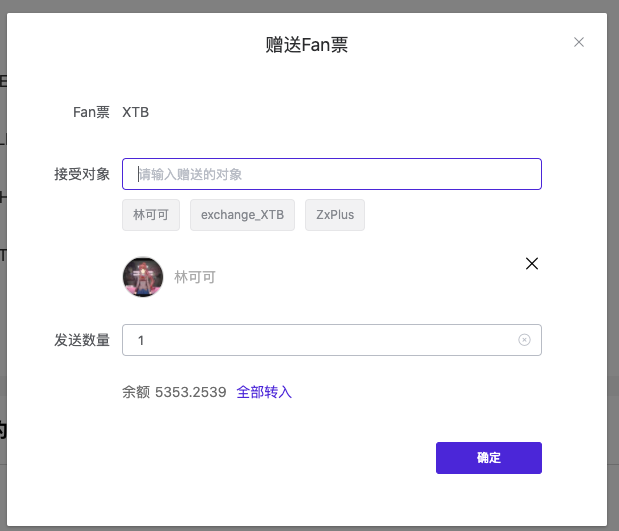
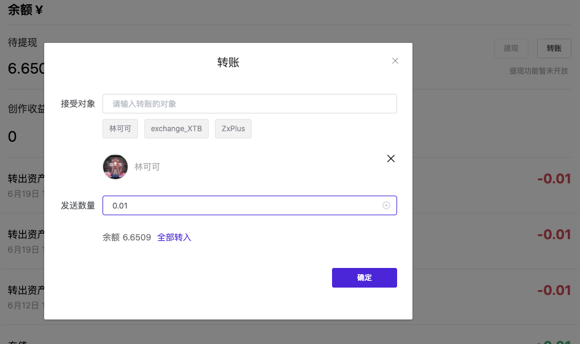

# Fan票系统

### fan票列表
* GET /token/all
* 参数：
    * page 默认值1
    * pagesize 默认值20
    * sort 排序方式，可选值：
        * general：综合排序
        * unit-price-(desc|asc)：单价排序
        * liquidity-(desc|asc)：流动金排序
        * exchange-(desc|asc)：24h成交量排序
        * name-(desc|asc)：首字母排序
        * time-(desc|asc)：时间排序
* 返回数据
```
{
    "code": 0,
    "message": "成功",
    "data": {
        "count": 38,
        "list": [
            {
                "id": 22,
                "uid": 526,
                "name": "岛岛币",
                "symbol": "DAO",
                "decimals": 4,
                "total_supply": 260000000,
                "create_time": "2019-09-30T10:37:15.000Z",
                "status": 1,
                "logo": "/image/2019/09/30/f6bb15a48c91bb872045c471bf45af07.png",
                "brief": "xxx",
                "introduction": "xxxx",
                "contract_address": "0x280Be10b609F95f70E82c0D7151543f59102f47D",
                "username": "lychees",
                "nickname": "xiaodao",
                "avatar": "/avatar/2019/07/12/d0c1f59b794f1dd9437c84af8cc57b6e.png",
                "amount": 81577552,
                "liquidity": 137933397,
                "exchange_amount": 245069,
                "member": "0"
            }
        ]
    }
}
```

### Fan票的信息
* GET /minetoken/{tokenId}
* 参数：
    * tokenId
* 返回数据：
    - token总发行量：token.total_supply / (10^token.decimals)
    - token合约地址：token.contract_address

    - token现价：exchange.price（单位cny）
    - 流动金池：
        - CNY流动金：exchange.cny_reserve /(10^token.decimals)
        - token流动金：exchange.token_reserve / (10^token.decimals)
    - 24h成交量
        - token成交量：exchange.volume_24h / (10^token.decimals)
        - cny成交额：exchange.amount_24h / (10^token.decimals)
    - 24h成交量涨跌幅：exchange.change_24h
```
{
    "code": 0,
    "message": "成功",
    "data": {
        "user": {
            "id": 526,
            "username": "lychees",
            "platform": "github",
            "password_hash": null,
            "email": "",
            "nickname": "xiaodao",
            "avatar": "/avatar/2019/07/12/d0c1f59b794f1dd9437c84af8cc57b6e.png",
            "create_time": "2019-07-05T12:59:41.000Z",
            "introduction": "一個弱菜。",
            "accept": 1,
            "source": "ss",
            "reg_ip": null,
            "last_login_time": "2020-06-10T23:59:36.000Z",
            "is_recommend": 1,
            "referral_uid": 0,
            "last_login_ip": "127.0.0.1",
            "level": 1,
            "status": 3,
            "banner": "/banner/2019/12/06/cb68b9c2f06b5390cdbc8d32db0d1e57.jpeg"
        },
        "token": {
            "id": 22,
            "uid": 526,
            "name": "岛岛币",
            "symbol": "DAO",
            "decimals": 4,
            "total_supply": 260000000,
            "create_time": "2019-09-30T10:37:15.000Z",
            "status": 1,
            "logo": "/image/2019/09/30/f6bb15a48c91bb872045c471bf45af07.png",
            "brief": "和我签订契约，成为魔法少女。",
            "introduction": "韵文在整个安琪拉里流淌，穿过每一个波浪，\n穿过每一个生命，韵文使我们成为一个整体。\n韵文约束着我们，约束着叙述者和探险者。\n我的故事将(会)成为你自己的故事,同时你的也会成为我的。\n你会通过我的眼睛经历我的一生....\n你也会认识到真理。",
            "contract_address": "0x280Be10b609F95f70E82c0D7151543f59102f47D"
        },
        "exchange": {
            "id": 36,
            "token_id": 22,
            "total_supply": 33262079,
            "create_time": "2019-11-30T09:25:59.000Z",
            "exchange_uid": 1072,
            "token_reserve": 81577552,
            "cny_reserve": 137933397,
            "volume_24h": 144762,
            "change_24h": 0.001722173464399639,
            "price": 1.6908,
            "amount_24h": 245069
        }
    }
}
```
### 查看用户发行的fan票
* GET token/user/{userId}
* 返回数据
```
{
    "code": 0,
    "message": "成功",
    "data": {
        "id": 44,
        "uid": 23,
        "name": "稳定币",
        "symbol": "DAI",
        "decimals": 4,
        "total_supply": 1000000000,
        "create_time": "2020-01-03T04:32:56.000Z",
        "status": 1,
        "logo": "/image/2020/01/03/882a27ba3e8a1b93a1ce66b05cdb6173.jpeg",
        "brief": "加油！奥力给！",
        "introduction": "",
        "contract_address": "0x4897835C0657A8d27b3Ab22AA3f09b49Ca4550d0"
    }
}
```

### Fan票持仓列表
* GET /token/{tokenId}/balances
* 参数：
    * pagesize 默认值 10
    * page 默认值 1
    * sort 排序方式
        * amount-(desc|asc) 持仓量排序
        * name-(desc|asc) 姓名排序
* 返回数据
```
{
    "code": 0,
    "message": "成功",
    "data": {
        "count": 197,
        "list": [
            {
                "id": 506,
                "uid": 1072,
                "token_id": 22,
                "amount": 81577552,
                "total_supply": 260000000,
                "username": "exchange_DAO",
                "nickname": null,
                "avatar": "/avatar/exchange.png"
            }
        ]
    }
}
```

### 流动金持仓列表
* GET /token/{tokenId}/liquidity/balances
* 其他同【Fan票持仓列表】

### Fan票流水列表
* GET /token/{tokenId}/transactions
* 参数：
    * pagesize 默认值 10
    * page 默认值 1
* 返回数据
```
{
    "code": 0,
    "message": "成功",
    "data": {
        "count": 838,
        "list": [
            {
                "token_id": 22,
                "from_uid": 1072,
                "to_uid": 2331,
                "amount": 134762,
                "create_time": "2020-06-11T04:39:53.000Z",
                "type": "exchange_purchase",
                "tx_hash": "0x740ad9ec829513d583882441584374789175a1d4f332a39450e7eac50268c43b",
                "name": "岛岛币",
                "symbol": "DAO",
                "decimals": 4,
                "from_username": "exchange_DAO",
                "from_nickname": null,
                "from_avatar": "/avatar/exchange.png",
                "to_username": "pengan1987",
                "to_nickname": "pengan",
                "to_avatar": "/avatar/2020/06/06/50916d14ec93e5860129db6d17653a28.jpg"
            }
        ]
    }
}
```
### 流动金流水列表
* GET /token/{tokenId}/liquidity/transactions
* 其他同【Fan票流水列表】

### fan票相关创作列表
* GET /minetoken/{tokenId}/related
* 参数： 
    * page: 1
    * pagesize: 10
    * filter:
        * 1: 持票可见
        * 2: 付费可见
        * 3: 持票可见 + 付费可见
    * sort: 
        * time-desc: 时间降序
        * popular-desc: 热度降序
* 返回数据：
```
{
    "code": 0,
    "message": "成功",
    "data": {
        "count": 65,
        "list": [
            {
                "id": 4331,
                "uid": 526,
                "author": "lychees",
                "title": "Defi Billboard Design Doc",
                "hash": "QmTHs6vyZqPzE4SP6zpsNK8P7pzQUkibLeYgKiHd5NXmMn",
                "create_time": "2020-06-11T04:42:26.000Z",
                "cover": "/image/2020/06/11/357064a8ff7856c838e50dd7bbc5664d.png",
                "require_holdtokens": 1,
                "require_buy": 0,
                "short_content": "。",
                "nickname": "xiaodao",
                "avatar": "/avatar/2019/07/12/d0c1f59b794f1dd9437c84af8cc57b6e.png",
                "read": 4,
                "likes": 3,
                "pay_platform": null,
                "pay_symbol": null,
                "pay_price": null,
                "pay_decimals": null,
                "pay_stock_quantity": null,
                "token_id": 22,
                "token_amount": 1000000,
                "token_name": "岛岛币",
                "token_symbol": "DAO",
                "token_decimals": 4,
                "tags": []
            }
        ]
    }
}
```

### 查看我当前token的持仓
* GET /minetoken/balance
* 参数：
    * tokenId
* Headers
    * x-access-token: 用户登录的accessToken
* 返回数据
    * 持仓量 = data / (10^token_decimals)
```
{
    "code": 0,
    "message": "成功",
    "data": 111434
}
```

### Fan票转账

* POST /minetoken/transfer
* Headers
    * x-access-token: 用户登录的accessToken
* request body
    * tokenId:fan票id
    * to: 转给的用户id
    * amount: 转账数量
    * memo: 转账留言
```
{
    "tokenId":14,
    "to":38,
    "amount":10000,
    "memo": "奥利给"
}
```
* 返回数据
tx_hash为交易成功的链上hash
```
{
    "code":0,
    "message":"成功",
    "data":{
        "tx_hash":"0xebd43a6af34dea4004f75134d0a65db3f42a48104165b85e4bda552325cce0ca"
    }
}
```

### CNY转账

* POST /asset/transfer
* Headers
    * x-access-token: 用户登录的accessToken
* request body
```
{"symbol":"CNY","to":38,"amount":100}
```
* 返回数据
```
{"code":0,"message":"成功"}
```